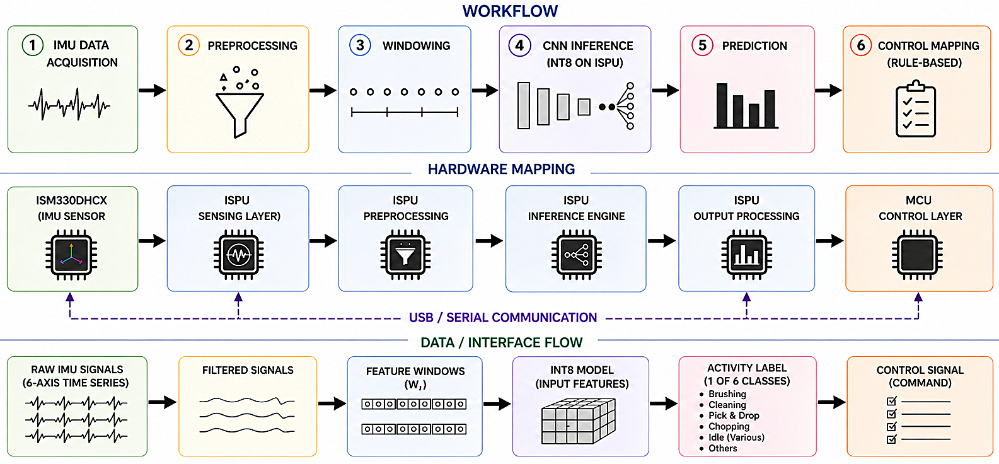
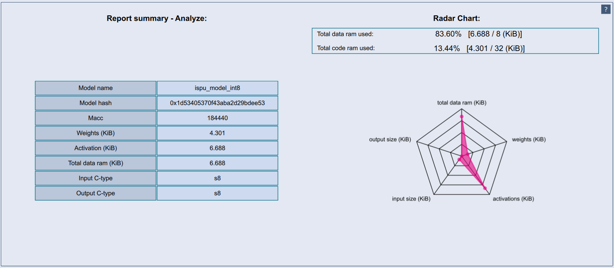
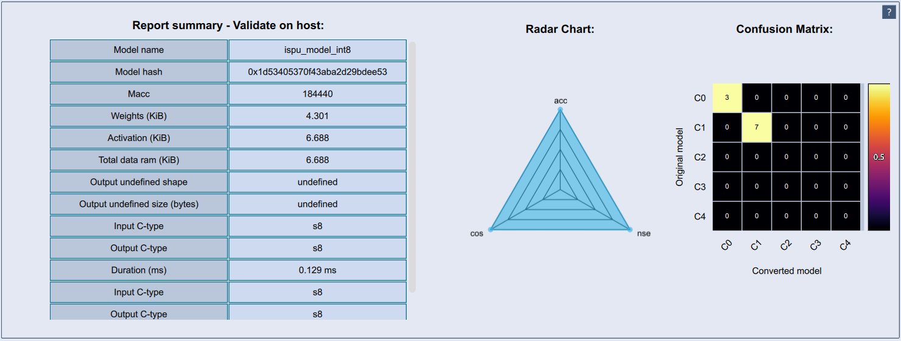
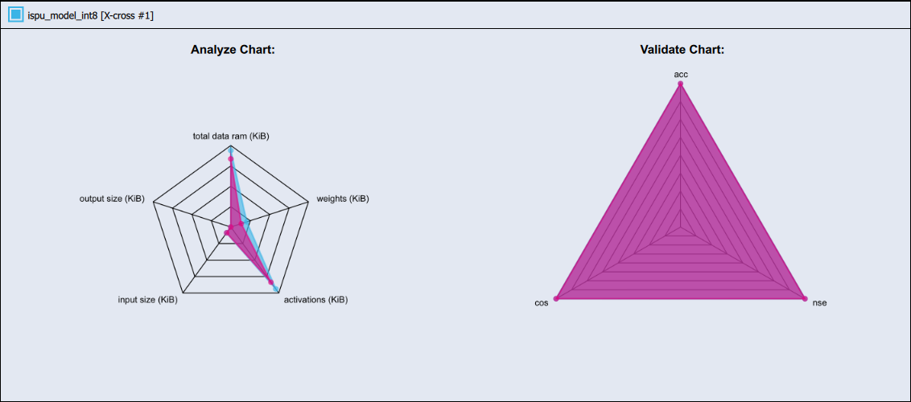
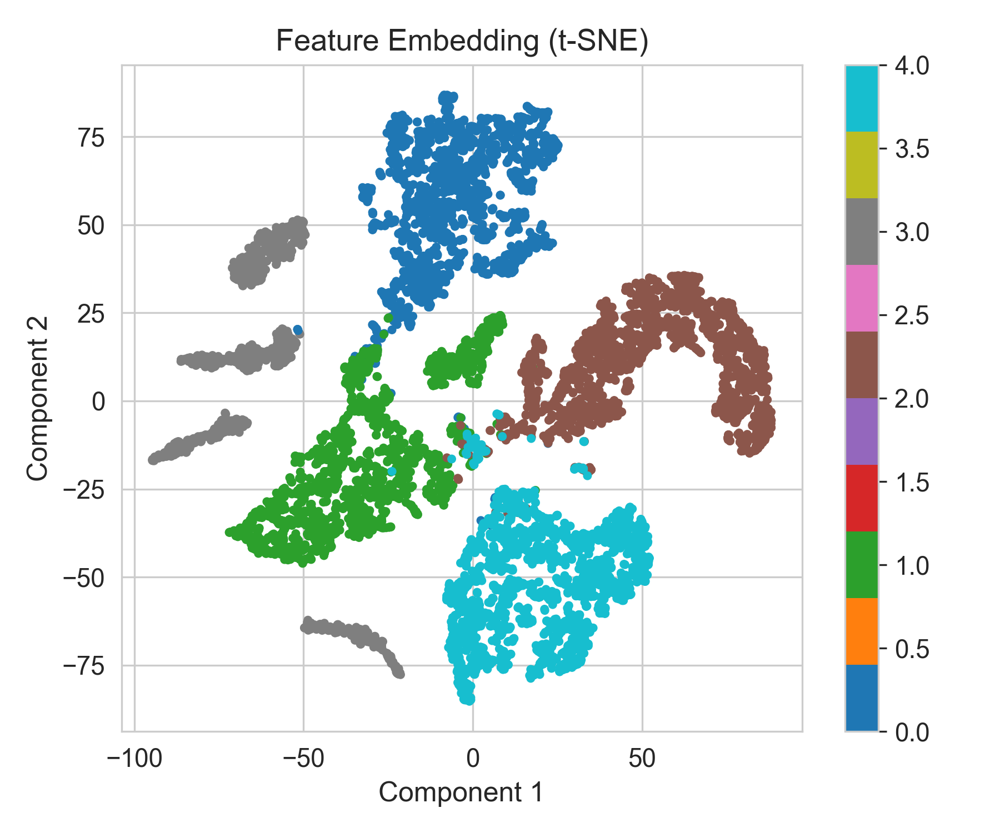

# ISPU-HAR: TinyML Human Activity Recognition for ST MEMS ISPU

<div align="center">

# IEEE COINS 2026 ISPU Competition Submission


*End-to-end TinyML workflow for Human Activity Recognition targeting ultra-low-power ST MEMS Intelligent Sensor Processing Units.*

</div>

---

# Overview

ISPU-HAR demonstrates a complete TinyML pipeline from custom sensor data acquisition to embedded AI deployment artefacts. The project was developed for the IEEE COINS 2026 ISPU Technical Competition.

---

# Competition Highlights

- ✅ Custom multi-user HAR dataset
- ✅ TinyML 1D CNN
- ✅ INT8 quantisation
- ✅ ST Edge AI integration
- ✅ ISPU-target generation
- ✅ Benchmarking
- ✅ Validation
- ✅ Runtime generation

---

# Hardware Setup

| Component | Device |
|---|---|
| MCU | NUCLEO-F401RE |
| Sensor Board | X-NUCLEO-IKS5A1 |
| AI Sensor | ST MEMS ISPU-capable IMU |


---

# Workflow



```text
Raw Data
 ↓
Cleaning
 ↓
Windowing
 ↓
Training
 ↓
INT8 Quantisation
 ↓
ST Edge AI
 ↓
Benchmark
 ↓
Validation
 ↓
Runtime Generation
```

---

# Model Summary

| Metric | Value |
|---|---:|
| Architecture | TinyML 1D CNN |
| Quantisation | INT8 |
| Parameters | 4,173 |
| Weights | 4.30 KiB |
| Activation RAM | 6.69 KiB |
| MACC | 184,440 |
| Input | 1×120×6 |
| Classes | 5 |

---

# Benchmark Dashboard

| Metric | Result |
|---|---:|
| Runtime | ST Edge AI |
| Cosine Similarity | 0.99939 |
| Estimated Inference | 0.129 ms |
| Runtime Sources | Generated |
| Validation Dataset | Generated |

---

# Results Gallery

## Analysis


## Validation


## Radar


## Feature Embedding


---

# Repository

```
Data/
Documentation/
converter code/
validation code/
MEM_STUDIO_OUT/
Training Scripts/
```

---

# Key Outputs

- ispu_model_int8.tflite
- network.c
- network_data.c
- network.h
- network_data.h
- network_val_io.npz
- Runtime libraries
- Benchmark reports

---

# Reproduce

1. Collect data.
2. Clean and preprocess.
3. Train TinyML model.
4. Quantise to INT8.
5. Convert using ST Edge AI.
6. Benchmark.
7. Validate.
8. Generate deployment artefacts.

---

# Applications

- Wearables
- Smart healthcare
- Assisted living
- Worker safety
- Human-machine interaction
- Context-aware IoT

---

# Roadmap

- [x] Dataset
- [x] Training
- [x] Quantisation
- [x] ST Edge AI
- [x] Benchmark
- [x] Runtime generation
- [ ] Extended on-target deployment

---

# Acknowledgements

Developed for the IEEE COINS 2026 ISPU Technical Competition using the STMicroelectronics Edge AI ecosystem.

<div align="center">

### ⭐ Adewale Ogabi, Michael Short, and Dunsi Dipo.

</div>
